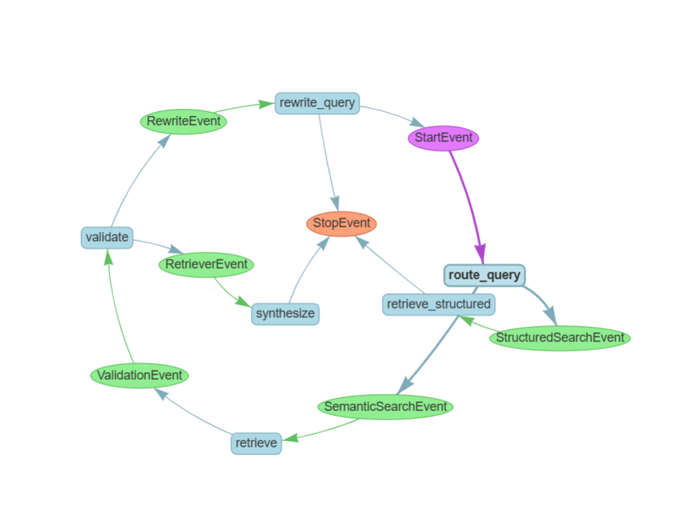

# 🤖 Agentic RAG Assistant for Coding Documentation

פרויקט RAG מתקדם המאפשר לתשאל תיעוד פרויקט שנוצר על ידי כלי Agentic Coding (כמו Cursor, Claude Code וכו'). 
המערכת משלבת חיפוש סמנטי (Vector Search) יחד עם חילוץ נתונים מובנים (Structured Data Extraction) כדי לספק תשובות מדויקות גם לשאלות כמותיות ומנהלתיות.

## 🚀 תכונות עיקריות
- **Hybrid Search:** ניתוב חכם בין חיפוש וקטורי (Pinecone/Local) לבין בסיס נתונים מובנה (JSON).
- **Event-Driven Workflow:** ארכיטקטורה מבוססת אירועים באמצעות LlamaIndex Workflows.
- **Self-Healing:** יכולת ניסוח מחדש של שאילתות (Query Rewriting) במידה ולא נמצא מידע רלוונטי.
- **UI:** ממשק צ'אט אינטראקטיבי המבוסס על Gradio.

## 🛠 טכנולוגיות
- **Framework:** LlamaIndex
- **LLM & Embeddings:** Cohere (Command-R)
- **Database:** JSON / Vector Store
- **Interface:** Gradio

## 📊 ארכיטקטורת התהליך

### 🛡️ מנגנוני הגנה (Guardrails) - מניעת לולאות אינסופיות
בתרשים ניתן לראות מעגל של תיקון עצמי (מ-`validate` ל-`rewrite_query` ובחזרה ל-`StartEvent`). חשוב לציין **שזו אינה לולאה אינסופית**. 
המערכת מנהלת "מונה ניסיונות" (Retry Counter) שמוגבל למקסימום 3 סיבובים. אם לאחר 3 ניסיונות ניסוח מחדש ה-Agent עדיין לא מוצא מידע רלוונטי בתיעוד, המערכת עוצרת את הלולאה בצורה מבוקרת (דרך `StopEvent`) ומחזירה למשתמש הודעה מסודרת שהמידע לא קיים בפרויקט.

## 📖 איך להריץ?
1. התקנת דרישות: `pip install -r requirements.txt`
2. חילוץ נתונים מובנים: `python extract_data.py`
3. הרצת ה-Assistant: `python workflow_chat.py`